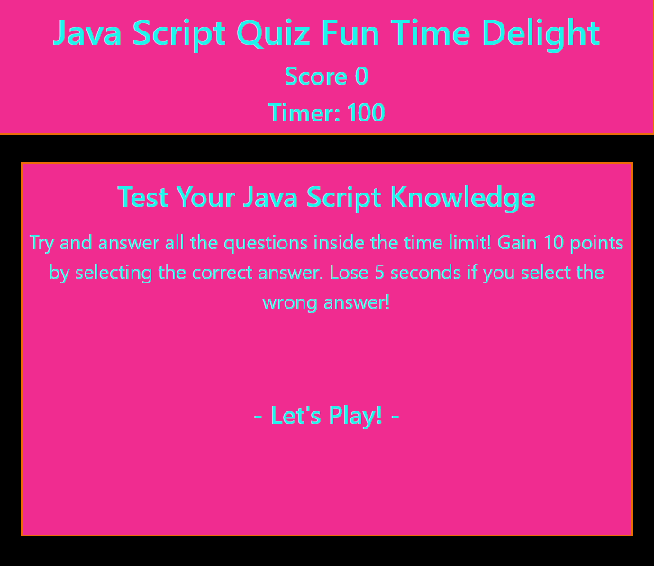

# Java Script Quiz

This project was a way to practice manipulating DOM objects with Java Script. The objective was to dynamically load questions to the user. 

## Objective:

- Create a responsive website from scratch
- Generate new questions to the user as the click through their responses
- Notify the user if their response is wrong
- End the game when the timer hits zero or all questions have been answered

[Random Password Generator](https://diegopie.github.io/java-script-timed-quiz/) is hosted on GitHub pages. 

## Outcome: 

This project helped me to better utilize functions to streamline my code. I still have some ways to go to really understand the power of functions but I am happy with the results right now. There is definitely room for improvement in this code, particulary with how I load quesions to the page.

## Collaborators:

It should not go without saying that none of this is possible without the Bootstrap team.

I would like to thank Diana Shull, Christian Blswell, Alvin Clemins, and Clarrisa for brainstorming how to approach this project and collaborating with specific issues in our code. 

This application was authored by [Diego Hernandez](https://github.com/Diegopie)
